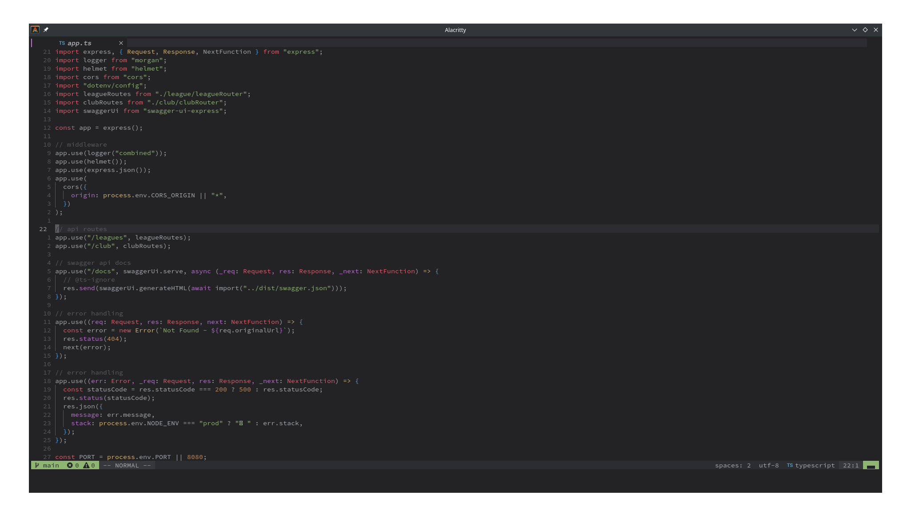

<!-- PROJECT LOGO -->
<br />
<p align="center">
  

  <h3 align="center">Config Files</h3>

  <p align="center">
  All my configurations for the tools I use
  </p>
</p>

## Installation

```sh
git clone https://github.com/michaelnavs/config.git
```

```sh
cd config
```

```sh
./setup.sh
```

## Main Tools Used

- [Alacritty](https://alacritty.org/)
- [Neovim](https://neovim.io/)
- [Tmux](https://github.com/tmux/tmux)
- [Yabai](https://github.com/koekeishiya/yabai)

## Tools' Configurations

_If a tool is not specified below, it uses default configurations_

### Alacritty | Zsh | Starship


- [Alacritty](./alacritty/alacritty.yml) is my terminal emulator of choice. I love how fast and minimal it is. I also love how easy it is to customize it. You can find more information on Alacritty [here](https://alacritty.org/). I am using the [Doom One](https://github.com/eendroroy/alacritty-theme/blob/master/themes/doom_one.yml) color scheme, but modify the background color and foreground color to match my Neovim theme. The font I use is [Monofur Nerd Font](https://www.nerdfonts.com/font-downloads)
- [Zsh](./.zshrc) is my terminal shell. I have paired it with Oh-my-zsh, which allows me to install plugins like auto-suggestion and many more. You can find more information on Zsh [here](https://www.zsh.org/) and Oh-my-zsh [here](https://ohmyz.sh/)
- [Starship](./starship.toml) is my shell prompt. I only changed the icons to use Nerd Font icons. You can find more information [here](https://starship.rs/presets/#nerd-font-symbols) 

### Neovim



- [Neovim](./nvim) is my text editor of choice. When I was first introduced to Neovim, I was instantly hooked into using it. I love how quick and minimal it is. 
- My Neovim config is 100% lua with a little sprinkle of vimscript inside lua files.
- The color-scheme I use, is called [OneDark](https://github.com/navarasu/onedark.nvim) Warmer variation.  
- If you are new to Neovim, I highly recommend checking out [Chris@machine](https://www.youtube.com/playlist?list=PLhoH5vyxr6Qq41NFL4GvhFp-WLd5xzIzZ) on YouTube. He makes videos on different Neovim plugins (extensions) that are easy to follow and he explains why he likes using said plugin. My Neovim config derives from Chris@Machine, but I have added other plugins and keybindings that I like.

### Tmux


- [Tmux](https://github.com/tmux/tmux) is a great combo with Alacritty. You can easily add more terminal windows within one, to keep your workspace organized. It can also save sessions so a simple command can bring you right back to your project at ease.
- There is not much to my tmux config, besides binding prefix to Ctrl+j 
- I use [tpm](https://github.com/tmux-plugins/tpm) to install plugins, which needs to be installed before using my tmux config file.
- Currently, I only have three plugins installed:
  - [tmux-sensible](https://github.com/tmux-plugins/tmux-sensible), improves default settings and keybindings.    
  - [tmux-themepack](https://github.com/jimeh/tmux-themepack), used for easily setting different color schemes.    
  - [tmux-onedark-theme](https://github.com/odedlaz/tmux-onedark-theme), which converts the boring lime green tmux bar, with one styled like a powerline prompt in onedark color scheme.

### Yabai | Spacebar | Skhd | Karabiner

```sh
sudo yabai --uninstall-sa
```

```sh
sudo yabai --install-sa
```

```sh
sudo yabai --load-sa
```

```sh
brew services restart skhd
```
